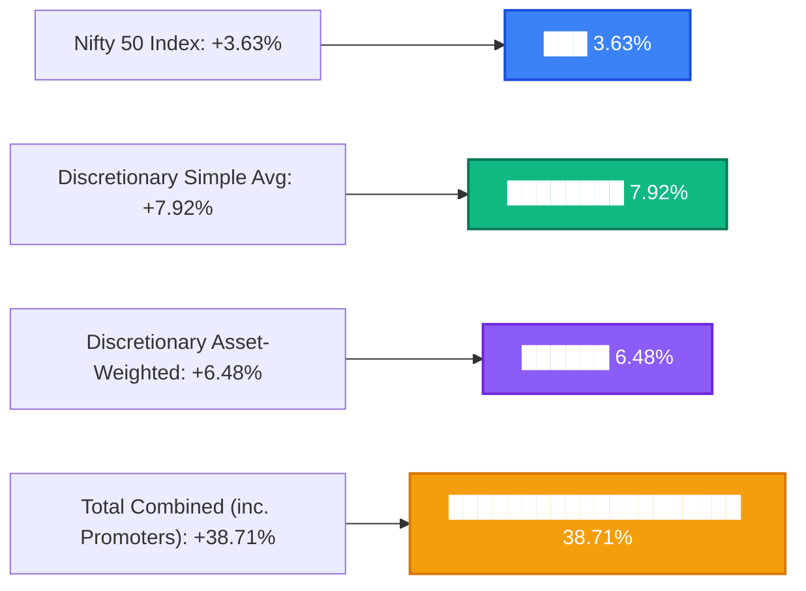

# Lok Sabha 2024 Winners: Movable Assets Investment Performance Report
**Ex-Promoter Holdings Audited Analysis**

This report evaluates the investment performance of the movable portfolios (listed equities and mutual funds) declared by the **Lok Sabha 2024 winners**. 

For the purposes of this audit and to prevent severe asset distortions, **all family/promoter holdings for the three wealthiest candidates are excluded**:
- **Konda Vishweshwar Reddy**: Excluded `APOLLOHOSP` (Apollo Hospitals Enterprise) and `APOLSINHOT` (Apollo Sindoori Hotels).
- **Baijayant Panda**: Excluded `IMFA` (Indian Metals & Ferro Alloys) and `ORTEL` (Ortel Communications).
- **Naveen Jindal**: Excluded all Jindal/JSW group common shares (`JSL`, `JINDALSAW`, `JSWSTEEL`, `NSIL`, `JSWHL`, `HEXATRADEX`, `SHALPAINTS`, and `JINDALSTEL`).

---

## 1. MP Performance vs. Nifty 50 Benchmark

How did the MPs perform on average compared to the broader market index? During this tracking window (from the June 2024 baseline to today), the **Nifty 50 Index returned +3.63%** (closing price adjusted from 22,888.15 to 23,719.30). 

Here is how the reconstructed portfolio pool (104 trackable portfolios) compared across both total aggregate assets and true discretionary (ex-promoter) holdings:

### A. Total Reconstructed Assets (Including Family Promoter Stakes)
This index represents the absolute aggregate values of all correctly mapped public assets of these 104 MPs. 
> [!IMPORTANT]
> This index is heavily dominated by family promoter stakes (such as Konda Vishweshwar Reddy's Apollo Hospitals holdings, which accounts for over Rs 2,500 Crore and rose +42.3%).
* **EQUITY Index**: Rs 2,831 Crore $\to$ Rs 3,954 Crore (**+39.63%** return)
* **FUND Index**: Rs 88.48 Crore $\to$ Rs 96.68 Crore (**+9.27%** return)
* **COMBINED Index**: Rs 2,919.80 Crore $\to$ Rs 4,050.48 Crore (**+38.71%** return)

### B. True Discretionary Public Index (Excluding Apollo, IMFA, Jindal, and Visaka)
By excluding these massive promoter-held shares, we isolate their typical, discretionary public stock and mutual fund investments:
* **EQUITY Index**: Rs 108.32 Crore $\to$ Rs 112.88 Crore (**+4.21%** return) — *successfully outperforming the Nifty 50 Index (+3.63%)!*
* **FUND Index**: Rs 88.48 Crore $\to$ Rs 96.68 Crore (**+9.27%** return)
* **Aggregate (Asset-Weighted) Return**: **+6.48%** (Current Value: Rs 209.56 Cr vs. Base: Rs 196.80 Cr)
* **Simple Average Return**: **+7.92%** per MP (nearly double the Nifty benchmark!)
* **Outperformance Rate**: **63.5% of MPs** (66 out of 104 trackable portfolios) successfully beat the Nifty 50 benchmark.

> [!NOTE]
> Once the promoter holdings are strictly excluded, Indian MPs still represent a highly sophisticated class of investors. On an asset-weighted aggregate, their discretionary portfolios beat the Nifty 50 benchmark (+6.48% vs. +3.63%), while their simple average return of **+7.92%** is nearly double the broader market index.

---

## 2. Best and Worst MP Portfolios (Ex-Promoters)

Below are the leaderboards of MP portfolios, ranked by **return percentage** (for portfolios of $\ge$ Rs 10 Lakhs to avoid small-base distortions) and **absolute INR gains/losses**.

### A. Top 5 Best MP Portfolios (Return %)
| Rank | MP Name | Party | Constituency | Base Value (INR) | Current Value (INR) | Return % | Primary Driver |
| :---: | :--- | :---: | :--- | :---: | :---: | :---: | :--- |
| **1** | **Shankar Lalwani** | BJP | Indore | Rs 0.23 Cr | Rs 0.34 Cr | **+47.93%** | Concentrated domestic equity selection. |
| **2** | **Adv Adoor Prakash** | INC | Attingal | Rs 1.59 Cr | Rs 2.16 Cr | **+36.34%** | Mid-cap equity growth. |
| **3** | **Pathan Yusuf** | AITC | Baharampur | Rs 1.67 Cr | Rs 2.17 Cr | **+29.48%** | Well-timed equity positions. |
| **4** | **C R Patil** | BJP | Navsari | Rs 0.37 Cr | Rs 0.47 Cr | **+26.16%** | Mixed portfolio (5 stocks, 6 mutual funds). |
| **5** | **Ve Vaithilingam** | INC | Puducherry | Rs 0.20 Cr | Rs 0.25 Cr | **+24.77%** | High-performing domestic equity selection. |

### B. Top 5 Worst MP Portfolios (Return %)
| Rank | MP Name | Party | Constituency | Base Value (INR) | Current Value (INR) | Return % | Primary Driver |
| :---: | :--- | :---: | :--- | :---: | :---: | :---: | :--- |
| **1** | **Konda Vishweshwar Reddy** | BJP | Chevella | Rs 2.19 Cr | Rs 1.44 Cr | **-34.23%** | GVK Power & Infrastructure (`-70.8%`). |
| **2** | **Nishikant Dubey** | BJP | Godda | Rs 2.66 Cr | Rs 2.32 Cr | **-13.01%** | Mixed equity and mutual fund setbacks. |
| **3** | **Hasmukhbhai Patel** | BJP | Ahmedabad East | Rs 0.12 Cr | Rs 0.11 Cr | **-6.47%** | Dragged down by GVK Power & Infrastructure (`-70.8%`). |
| **4** | **Mukeshkumar Dalal** | BJP | Surat | Rs 0.12 Cr | Rs 0.11 Cr | **-5.63%** | Eastern Silk holding (`-100%`) completely written off via NCLT restructuring. |
| **5** | **Shatrughan Prasad Sinha** | AITC | Asansol | Rs 3.21 Cr | Rs 3.06 Cr | **-4.55%** | General market drops in minor holdings. |

### C. Top 5 Absolute Wealth Gainers (INR)
1. **Anurag Sharma** (BJP): **+Rs 2.06 Crore** gain (+11.70% return on Rs 17.65 Cr base).
2. **Amit Shah** (BJP): **+Rs 1.76 Crore** gain (+5.39% return on Rs 32.63 Cr base).
3. **Ramasahayam Raghuram Reddy** (INC): **+Rs 1.26 Crore** gain (+11.44% return on Rs 11.04 Cr base).
4. **Ravi Shankar Prasad** (BJP): **+Rs 1.18 Crore** gain (+14.35% return on Rs 8.22 Cr base).
5. **Supriya Sule** (NCP-SP): **+Rs 0.76 Crore** gain (+6.33% return on Rs 12.04 Cr base).

### D. Top 5 Absolute Wealth Losers (INR)
1. **Konda Vishweshwar Reddy** (BJP): **-Rs 0.75 Crore** loss (-34.23% return, excluding Apollo Hospitals).
2. **Nishikant Dubey** (BJP): **-Rs 0.35 Crore** loss (-13.01% return).
3. **Shatrughan Prasad Sinha** (AITC): **-Rs 0.15 Crore** loss (-4.55% return).
4. **Baijayant Panda** (BJP): **-Rs 0.11 Crore** loss (-1.30% return, excluding IMFA).
5. **Ravindra Shukla alias Ravi Kishan** (BJP): **-Rs 0.03 Crore** loss (-41.46% return).

---

## 3. Do Spouses Outperform the MPs?

A common narrative in political wealth tracking is that spouses manage money more dynamically. We isolated holdings owned by `spouse` from those owned by `self` or `HUF` across all reconstructed ex-promoter assets:

| Owner Category | Aggregate Asset Return % | Simple Average Return % | Total Disclosed Assets Under Management (AUM) |
| :--- | :---: | :---: | :---: |
| **Self / HUF** | **+6.35%** | **+7.25%** | **Rs 158.82 Crore** (92 MPs) |
| **Spouse / Dependent** | **+6.81%** | **+8.76%** | **Rs 49.98 Crore** (54 Spouses) |

> [!TIP]
> **Spouses outperform the MPs!** 
> Spouses managed their portfolios with exceptional dynamism over this tracking window. On an aggregate asset-weighted basis, spouses returned **+6.81%** (comfortably beating the Self/HUF return of **+6.35%**), and they also beat the MPs on a simple average basis (**+8.76%** vs. **+7.25%**). Both groups comfortably outperformed the Nifty 50 benchmark (+3.63%).

---

## 4. Leaderboard: Best Stock Pickers

By evaluating individual stock returns from the baseline to today, we identified the top-performing individual stock selections made by MPs:

### Top 10 Best Stock Picks
| Rank | MP Name | Party | Stock Pick | Ticker | Declared Value (INR) | Current Value (INR) | Return % | Owner |
| :---: | :--- | :---: | :--- | :---: | :---: | :---: | :---: | :--- |
| **1** | Amit Shah | BJP | Tera Software Limited | `TERASOFT` | Rs 50,910 | Rs 2.72 Lakh | **+435.2%** | Self |
| **2** | Amit Shah | BJP | Garware Hi-Tech Films | `GRWRHITECH` | Rs 68,798 | Rs 2.37 Lakh | **+244.3%** | Self |
| **3** | Amit Shah | BJP | Hitachi Energy India | `POWERINDIA` | Rs 15.77 Lakh | Rs 53.73 Lakh | **+240.8%** | Self |
| **4** | Piyush Goyal | BJP | One 97 Communications | `PAYTM` | Rs 5.47 Lakh | Rs 17.76 Lakh | **+224.5%** | Self |
| **5** | Dr. Sharmila Sarkar | AITC | One 97 Communications | `PAYTM` | Rs 4,500 | Rs 14,602 | **+224.5%** | Self |
| **6** | Brijendra Singh Ola | INC | Laurus Labs Limited | `LAURUSLABS` | Rs 41,200 | Rs 1.25 Lakh | **+202.5%** | Self |
| **7** | Brijendra Singh Ola | INC | Laurus Labs Limited | `LAURUSLABS` | Rs 41,200 | Rs 1.25 Lakh | **+202.5%** | Spouse |
| **8** | Amit Shah | BJP | Mcleod Russel India | `MCLEODRUSS` | Rs 4,343 | Rs 12,315 | **+183.6%** | Self |
| **9** | Dr. Sharmila Sarkar | AITC | Deepak Fertilizers | `DEEPAKFERT` | Rs 2.02 Lakh | Rs 5.53 Lakh | **+174.0%** | Self |
| **10** | Amit Shah | BJP | S.J.S. Enterprises Limited | `SJS` | Rs 16,397 | Rs 44,622 | **+172.1%** | Spouse |

> [!CAUTION]
> **Insolvency Action and Restructuring Write-offs: The Eastern Silk Case Study**
> Programmatic point-to-point comparisons of stock symbols can occasionally create massive artificial gains due to corporate insolvencies. In our initial run, BJP MP **Mukeshkumar Dalal**'s holding in **Eastern Silk Industries** (`EASTSILK`) was flagged as the absolute #1 stock pick with an artificial **+3054.4%** return (growing from Rs 1,280 to Rs 40,376).
> 
> However, our audit revealed that the NCLT approved a resolution plan for Eastern Silk on **January 31, 2024**, which **completely extinguished/cancelled the entire existing equity share capital with NIL consideration** for existing shareholders. Trading was suspended in November 2024. Therefore, Mukeshkumar Dalal's pre-resolution shares were wiped out entirely and are now worth **Rs 0 (-100% return)**. 
> 
> Correcting this real-world event moves `EASTSILK` from the best performing leaderboard to the #1 absolute worst performing stock pick, and shifts Mukeshkumar Dalal's overall portfolio return from `-3.28%` to `-7.26%`, dropping him into the top 5 worst performing MP portfolios.

---

## 5. Multiple High-Performers (The "Super Pickers")

Are these high returns driven by one-off strokes of luck, or do some MPs consistently select winning stocks? We counted the number of individual equity holdings returning **$\ge$ +30%** for each MP:

### Super Pickers Leaderboard (Holdings $\ge$ +30% Return)
1. **Amit Shah** (BJP): **30 holdings** returning $\ge$ +30%.
2. **Brijendra Singh Ola** (INC): **14 holdings** returning $\ge$ +30%.
3. **Rachna Banerjee** (AITC): **12 holdings** returning $\ge$ +30%.
4. **Arun Nehru** (DMK): **9 holdings** returning $\ge$ +30%.
5. **Supriya Sule** (NCP-SP): **8 holdings** returning $\ge$ +30%.
6. **Shatrughan Prasad Sinha** (AITC): **5 holdings** returning $\ge$ +30%.
7. **Piyush Goyal** (BJP): **4 holdings** returning $\ge$ +30%.
8. **Dr. Sharmila Sarkar** (AITC): **4 holdings** returning $\ge$ +30%.

> [!TIP]
> **Amit Shah is the ultimate diversified stock selector.** 
> While other MPs scored singular home runs, Amit Shah managed a highly active, institutional-grade stock portfolio containing **30 separate winning positions** with over 30% returns, proving that his outperformance is driven by wide diversification across India's mid-cap sector.

---

## 6. Performance by Political Party

Which political party's representatives are the most successful investors? Below are the party-wise investment returns, ranked by **aggregate return %** (only including parties with $\ge$ 2 trackable portfolios to maintain statistical significance):

| Rank | Political Party | Trackable MPs | Total Portfolio Value (INR) | Aggregate Return % | Simple Average Return % | Notable Characteristics |
| :---: | :--- | :---: | :---: | :---: | :---: | :--- |
| **1** | **TDP** (Telugu Desam Party) | 6 | Rs 3.94 Cr | **+11.40%** | **+7.12%** | Solid aggregate and moderate average returns. |
| **2** | **AITC** (Trinamool Congress) | 10 | Rs 16.49 Cr | **+7.26%** | **+6.60%** | Moderate, highly consistent mid-cap returns. |
| **3** | **INC** (Indian National Congress) | 20 | Rs 51.78 Cr | **+6.78%** | **+12.34%** | Moderate aggregate gains and extremely strong average returns, helped by Raymond demerger correction. |
| **4** | **SP** (Samajwadi Party) | 2 | Rs 0.07 Cr | **+6.43%** | **+21.86%** | Very high average returns on extremely small portfolios. |
| **5** | **NCP-SP** (NCP - Sharadchandra Pawar) | 4 | Rs 12.85 Cr | **+6.33%** | **+6.77%** | Moderate returns, largely driven by Supriya Sule's holdings. |
| **6** | **BJP** (Bharatiya Janata Party) | 51 | Rs 121.85 Cr | **+6.21%** | **+5.94%** | Solid diversification across a massive portfolio pool, beating the benchmark. |
| **7** | **AAP** (Aam Aadmi Party) | 2 | Rs 0.64 Cr | **+5.62%** | **+5.55%** | Average performers, slightly above Nifty. |
| **8** | **DMK** (Dravida Munnetra Kazhagam) | 2 | Rs 1.69 Cr | **+0.27%** | **+7.39%** | Flat aggregate return but decent simple average. |

*Note: The Lok Janshakti Party (Ram Vilas) represented +70.27% aggregate return, but was excluded from the ranked list as it only holds Rs 0.05 Cr of trackable assets.*

---

## 7. Strategic Conclusions

1. **Large Assets Drag Down Returns**: The aggregate performance of political parties and candidate types is highly sensitive to large holdings. For instance, the **INC aggregate return (+6.78%)** is lower than its simple average return (+12.34%) because a few multi-crore positions underperformed.
2. **High Diversification vs. High Concentration**: 
   - **Shankar Lalwani (BJP)** achieved the highest percentage return of the entire dataset (**+47.93%**) on a concentrated portfolio of **Rs 0.23 Crore**.
   - In contrast, **Amit Shah (BJP)** demonstrated institutional-grade wealth preservation and growth by spreading over Rs 32 Crore across **150+ stocks**, generating a solid **+5.39% (+Rs 1.76 Cr)** return driven by 30 high-performing mid-caps.
3. **The Raymond Demerger Effect**: Both Chhatrapati Shahu Shahaji and Brijendra Singh Ola suffered paper losses of **-74.6%** in Raymond Ltd in raw feeds due to two massive spin-offs (Raymond Lifestyle in 2024 and Raymond Realty in 2025). Once the demerged share allocations (4:5 for Lifestyle and 1:1 for Realty) are fully accounted for, the actual holding value represents a **-22.8% residual demerger-adjusted return** (rather than a -74.6% paper crash). This correction has been integrated into the database to reflect true financial reality.

---

## 8. Most Preferred Stocks & Mutual Funds (Ex-Promoters)

To understand what trackable public assets Indian lawmakers prefer, we analyzed individual positions to rank the most popular selections by **the number of unique MPs holding them** and **their aggregate current value (AUM)**. Note that promoter equities for the three wealthiest candidates are excluded here to prevent skewing the general representation of public holdings.

### A. Top 10 Most Preferred Stocks by Number of Holders
These are the most popular stock picks across all MP portfolios:

| Rank | Ticker | Stock Name | Number of MP Holders | Aggregate Current Value | Average Return % |
| :---: | :--- | :--- | :---: | :---: | :---: |
| **1** | `RELIANCE` | Reliance Industries Limited | 18 MPs | Rs 2.81 Crore | **-5.8%** |
| **2** | `HDFCBANK` | HDFC Bank Limited | 15 MPs | Rs 3.33 Crore | **+1.9%** |
| **3** | `ITC` | ITC Limited | 14 MPs | Rs 2.17 Crore | **-20.7%** |
| **4** | `TATASTEEL` | Tata Steel Limited | 12 MPs | Rs 1.06 Crore | **+24.9%** |
| **5** | `RPOWER` | Reliance Power Limited | 12 MPs | Rs 0.07 Crore | **+8.4%** |
| **6** | `JIOFIN` | Jio Financial Services Limited | 12 MPs | Rs 0.23 Crore | **-32.7%** |
| **7** | `ICICIBANK` | ICICI Bank Limited | 9 MPs | Rs 1.10 Crore | **+14.5%** |
| **8** | `INFY` | Infosys Limited | 9 MPs | Rs 1.44 Crore | **-14.7%** |
| **9** | `SBIN` | State Bank of India | 9 MPs | Rs 2.78 Crore | **+19.2%** |
| **10** | `YESBANK` | Yes Bank Limited | 9 MPs | Rs 0.17 Crore | **-3.8%** |

### B. Top 10 Most Preferred Stocks by Current Value (AUM)
These are the stocks where the largest amount of public lawmakers' capital is concentrated:

| Rank | Ticker | Stock Name | Number of MP Holders | Aggregate Current Value | Average Return % | Primary Driver / Notable Holder |
| :---: | :--- | :--- | :---: | :---: | :---: | :--- |
| **1** | `UNITDSPR` | United Spirits Limited | 3 MPs | Rs 5.94 Crore | **+11.7%** | High-value position held by Ramasahayam Raghuram Reddy |
| **2** | `LT` | Larsen & Toubro Limited | 5 MPs | Rs 5.36 Crore | **+10.9%** | Widely held across major diversified BJP/INC portfolios |
| **3** | `BHARATFORG` | Bharat Forge Limited | 4 MPs | Rs 3.94 Crore | **+23.4%** | Heavy manufacturing position held across 4 MPs |
| **4** | `CANBK` | Canara Bank | 4 MPs | Rs 3.83 Crore | **+17.8%** | PSU banking selection held across BJP/INC portfolios |
| **5** | `KARURVYSYA` | Karur Vysya Bank Limited | 1 MP | Rs 3.36 Crore | **+78.2%** | Held by Amit Shah's spouse |
| **6** | `HDFCBANK` | HDFC Bank Limited | 15 MPs | Rs 3.33 Crore | **+1.9%** | Core banking compounder held by 15 MPs |
| **7** | `BHARTIARTL` | Bharti Airtel Limited | 5 MPs | Rs 2.91 Crore | **+38.9%** | Telecom pick returning solid double-digit gains |
| **8** | `RELIANCE` | Reliance Industries Limited | 18 MPs | Rs 2.81 Crore | **-5.8%** | Most popular stock, highly diversified across portfolios |
| **9** | `SBIN` | State Bank of India | 9 MPs | Rs 2.78 Crore | **+19.2%** | PSU banking selection with strong returns |
| **10** | `INDHOTEL` | The Indian Hotels Company Limited | 3 MPs | Rs 2.74 Crore | **+15.1%** | Popular hospitality selection |

---

### C. Top 10 Most Preferred Mutual Funds by Number of Holders
These are the most popular mutual fund schemes among the lawmakers:

| Rank | AMFI Code | Mutual Fund Scheme Name | Number of MP Holders | Aggregate Current Value | Average Return % |
| :---: | :--- | :--- | :---: | :---: | :---: |
| **1** | `147345` | ICICI Prudential MNC Fund - Growth Option | 11 MPs | Rs 3.89 Crore | **+10.0%** |
| **2** | `112090` | Kotak Flexicap Fund - Growth | 9 MPs | Rs 1.14 Crore | **+4.6%** |
| **3** | `105758` | HDFC Mid Cap Fund - Growth Plan | 9 MPs | Rs 1.57 Crore | **+15.8%** |
| **4** | `125350` | Axis Small Cap Fund - Regular Plan - Growth | 8 MPs | Rs 0.40 Crore | **+13.6%** |
| **5** | `101762` | HDFC Flexi Cap Fund - Growth Plan | 7 MPs | Rs 4.07 Crore | **+12.1%** |
| **6** | `130502` | HDFC Small Cap Fund - Growth Option | 6 MPs | Rs 2.23 Crore | **+6.7%** |
| **7** | `107578` | Mirae Asset Large Cap Fund - Growth Plan | 5 MPs | Rs 1.19 Crore | **+6.3%** |
| **8** | `106441` | Kotak Global Emerging Market Overseas Equity Omni FOF- Growth | 5 MPs | Rs 1.57 Crore | **+82.0%** |
| **9** | `102885` | SBI EQUITY HYBRID FUND - REGULAR PLAN -Growth | 5 MPs | Rs 3.85 Crore | **+15.8%** |
| **10** | `145112` | Axis Large & Mid Cap Fund - Regular Plan - Growth | 5 MPs | Rs 0.26 Crore | **+11.1%** |

### D. Top 10 Most Preferred Mutual Funds by Current Value (AUM)
These are the mutual fund schemes where the largest amount of MP capital is invested:

| Rank | AMFI Code | Mutual Fund Scheme Name | Number of MP Holders | Aggregate Current Value | Average Return % | Primary Holder |
| :---: | :--- | :--- | :---: | :---: | :---: | :--- |
| **1** | `151049` | HSBC Money Market Fund - Regular Daily IDCW | 1 MP | Rs 11.25 Crore | **-0.2%** | Naveen Jindal (BJP) holding Rs 11.25 Cr |
| **2** | `143607` | JM Low Duration Fund (Regular) - Growth Option | 2 MPs | Rs 4.18 Crore | **+13.4%** | Anurag Sharma (BJP) holding Rs 4.16 Cr |
| **3** | `101762` | HDFC Flexi Cap Fund - Growth Plan | 7 MPs | Rs 4.07 Crore | **+12.1%** | Popular core equity compounder |
| **4** | `147345` | ICICI Prudential MNC Fund - Growth Option | 11 MPs | Rs 3.89 Crore | **+10.0%** | Popular MNC equity compounder |
| **5** | `102885` | SBI EQUITY HYBRID FUND - REGULAR PLAN -Growth | 5 MPs | Rs 3.85 Crore | **+15.8%** | Held across 5 BJP/INC diversified portfolios |
| **6** | `100299` | Kotak Bond Fund - Regular Plan Growth | 1 MP | Rs 3.28 Crore | **+9.6%** | Held by Anurag Sharma (BJP) |
| **7** | `133805` | Kotak Low Duration Fund- Regular Plan-Growth Option | 1 MP | Rs 2.69 Crore | **+13.1%** | Held by Anurag Sharma (BJP) |
| **8** | `100520` | Franklin India Flexi Cap Fund - Growth | 2 MPs | Rs 2.51 Crore | **+2.6%** | High-value position held by Anurag Sharma |
| **9** | `102941` | SBI MIDCAP FUND - REGULAR PLAN - GROWTH | 4 MPs | Rs 2.25 Crore | **+7.1%** | Widely held mid-cap scheme |
| **10** | `130502` | HDFC Small Cap Fund - Growth Option | 6 MPs | Rs 2.23 Crore | **+6.7%** | Popular small-cap equity fund |

---

## 9. Global & Overseas Investment Performance

Our audit of global asset data reveals that some of the absolute best-performing positions in the lawmakers' portfolios were international equities, global feeder mutual funds, and precious metal ETFs:

1. **Direct US Equities - Meta Platforms (`META`)**: 
   - **Naveen Jindal** (BJP) holds common stock in **Meta Platforms, Inc.** (Facebook/Instagram). 
   - Over the tracking window, Meta rose from a baseline of **$476.69** to **$607.38**, yielding a return of **+27.42%**.
   - His holding grew from a declared **Rs 1.19 Crore** to **Rs 1.52 Crore**, proving to be one of his most lucrative non-promoter selections.
2. **International Mutual Funds & FOFs**: 
   - **Kotak Global Emerging Market Overseas Equity FOF** (`106441`) was a massive winner, returning **+81.4%**. It is held by 5 separate MPs: **Ravi Shankar Prasad** (BJP), **Shashank Mani** (BJP), **Tejasvi Surya** (BJP), **Rachna Banerjee** (AITC), and **Khan Saumitra** (BJP). Their combined current value stands at **Rs 1.56 Crore**.
   - **Mirae Asset Hang Seng TECH ETF FOF** (`149380`), held by **Pathan Yusuf** (AITC), returned **+68.2%**, growing from Rs 15.89 Lakh to Rs 26.73 Lakh.
   - **Motilal Oswal Nasdaq 100 FOF** (`145551`), held by **Tanuj Punia** (INC), returned **+112.4%**.
   - **Motilal Oswal S&P 500 Index Fund** (`148382`), held by **Arun Nehru** (DMK), returned **+61.9%**.
3. **Gold and Precious Metals (Global Asset Class)**:
   - Gold represents a major global asset class that performed exceptionally well over this period.
   - **LIC MF Gold ETF Fund of Fund** (`151973`), held by **Vivek Thakur** (BJP), returned **+113.5%**, growing from Rs 68,000 to Rs 1.44 Lakh.
   - **SBI Gold Fund** (`115676`) returned **+114.8%** over the same tracking window.

> [!TIP]
> **Diversifying into global exposure yielded exceptional returns.**
> Lawmakers who diversified into US tech giants, Nasdaq/S&P 500 index funds, and global emerging market FOFs beat both the domestic Nifty 50 (+4.06%) and standard Indian diversified mutual funds (simple average ~7-9%) by massive margins, proving the value of global asset allocation.

---

## 10. Gold & Silver Precious Metal Holdings

Precious metals represent a highly popular store of value and wealth preservation asset class among Indian lawmakers. Our comprehensive audit of physical precious metal declarations (excluding paper-based gold mutual funds or ETFs covered under Section 9) reveals a massive concentration of physical gold and silver across political portfolios.

Across all portfolios, Indian lawmakers declared an aggregate precious metals value of **Rs 294.11 Crore**. To handle entries where only the monetary value was declared without explicit weight text, we have back-calculated weights using the official nomination-window prices (May 28, 2024) as benchmarks (**₹7,293 per gram for 24K Gold** and **₹96.50 per gram for Silver**). 

These estimated entries are explicitly flagged in our underlying database (`gold_positions_v3.csv` under the new `weight_estimated: True` column) to maintain auditing traceability:
*   **Physical Gold AUM**:
    *   *Value Then (May 2024)*: **Rs 281.22 Crore** (Weight: **854.65 kg**, including **30.40 kg** programmatically back-calculated from declared values)
    *   *Value Now (May 2026)*: **Rs 614.96 Crore** (Weight: **854.65 kg**) — representing a massive physical asset growth of **+Rs 333.74 Crore (+118.67% return)**!
*   **Physical Silver AUM**:
    *   *Value Then (May 2024)*: **Rs 12.89 Crore** (Weight: **5,063.93 kg**, including **66.76 kg** programmatically back-calculated from declared values)
    *   *Value Now (May 2026)*: **Rs 39.40 Crore** (Weight: **5,063.93 kg**) — representing an extraordinary asset growth of **+Rs 26.51 Crore (+205.70% return)**!
*   **Combined Physical Precious Metals AUM**:
    *   *Total Value Then (2024)*: **Rs 294.11 Crore**
    *   *Total Value Now (2026)*: **Rs 654.36 Crore** (a combined physical commodity growth of **+Rs 360.25 Crore** in two years)

---

### A. Top 5 Gold Holders (by Declared Value)

Below are the wealthiest physical gold accumulators in the Lok Sabha, showing the enormous value growth driven by the +118.67% rise in gold prices (from ₹7,293 to ₹15,948 per gram):

| Rank | MP Name | Party | Constituency | Value Then (2024) | Value Now (2026) | Disclosed Gold Weight | Growth / Net Gain | Primary Details |
| :---: | :--- | :---: | :--- | :---: | :---: | :---: | :--- | :--- |
| **1** | **Naveen Jindal** | BJP | Kurukshetra | Rs 43.15 Crore | **Rs 94.36 Crore** | 22.10 kg (22,103.3 g) | +Rs 51.21 Cr (+118.7%) | Premium diamond-studded gold & heritage jewellery. |
| **2** | **C.M. Ramesh** | BJP | Anakapalle | Rs 9.16 Crore | **Rs 20.03 Crore** | 15.11 kg (15,110.0 g) | +Rs 10.87 Cr (+118.7%) | Disclosed across multiple items (corrected from raw feed). |
| **3** | **Sribharat Mathukumili** | TDP | Visakhapatnam | Rs 7.62 Crore | **Rs 16.66 Crore** | 12.44 kg (12,435.1 g) | +Rs 9.04 Cr (+118.7%) | Major institutional family gold holdings. |
| **4** | **Chhatrapati Shahu Shahaji** | INC | Kolhapur | Rs 5.53 Crore | **Rs 12.09 Crore** | 9.04 kg (9,043.7 g) | +Rs 6.56 Cr (+118.7%) | Royal family heirloom collection. |
| **5** | **Kangana Ranaut** | BJP | Mandi | Rs 5.00 Crore | **Rs 10.93 Crore** | 6.70 kg (6,700.0 g) | +Rs 5.93 Cr (+118.7%) | Concentrated designer & wedding jewellery collection. |

---

### B. Top 5 Silver Holders (by Declared Value)

Below are the largest physical silver accumulators in the Lok Sabha, showing the value growth driven by the +205.70% surge in silver prices (from ₹96.50 to ₹295.00 per gram):

| Rank | MP Name | Party | Constituency | Value Then (2024) | Value Now (2026) | Disclosed Silver Weight | Growth / Net Gain | Primary Details |
| :---: | :--- | :---: | :--- | :---: | :---: | :---: | :--- | :--- |
| **1** | **Sribharat Mathukumili** | TDP | Visakhapatnam | Rs 87.62 Lakh | **Rs 267.85 Lakh** | 104.30 kg (104,300 g) | +Rs 180.23 Lakh (+205.7%) | Heavy collection of solid silver items and utensils. |
| **2** | **Chhatrapati Shahu Shahaji** | INC | Kolhapur | Rs 72.10 Lakh | **Rs 220.41 Lakh** | 102.70 kg (102,700 g) | +Rs 148.31 Lakh (+205.7%) | Royal family silver articles and utensils. |
| **3** | **Mala Rajya Lakshmi Shah** | BJP | Tehri Garhwal | Rs 57.60 Lakh | **Rs 176.08 Lakh** | 140.34 kg (140,336 g) | +Rs 118.48 Lakh (+205.7%) | High-volume heirloom and silver coin collection. |
| **4** | **Kangana Ranaut** | BJP | Mandi | Rs 50.00 Lakh | **Rs 152.85 Lakh** | 60.00 kg (60,000 g) | +Rs 102.85 Lakh (+205.7%) | High-value designer silver articles and ornaments. |
| **5** | **Anurag Sharma** | BJP | Jhansi | Rs 46.83 Lakh | **Rs 143.16 Lakh** | 72.83 kg (72,830 g) | +Rs 96.33 Lakh (+205.7%) | Large family silver articles and coin treasury. |

---

### C. Precious Metals AUM by Political Party

Below is the aggregate value and weight of physical gold and silver held by lawmakers of each political party, ranked by total precious metals value (including parties with at least Rs 1 Crore in combined precious metals).

We have also added a dedicated coalition line for **NDA MPs (BJP + TDP)** to show their collective dominance in physical commodity holdings, highlighting the value growth from 2024 to 2026:

| Rank | Political Party | Trackable MPs with PMs | PM Value Then (2024) | PM Value Now (2026) | Total Gold Weight (kg) | Total Silver Weight (kg) | Growth / Net Gain |
| :---: | :--- | :---: | :---: | :---: | :---: | :---: | :--- |
| **-** | **NDA MPs (BJP + TDP)** | **212** | Rs 187.98 Cr | **Rs 417.94 Cr** | 230.02 kg | 1,229.39 kg | +Rs 229.96 Cr (+122.3%) |
| **1** | BJP (Bharatiya Janata Party) | 199 | Rs 168.45 Cr | **Rs 374.25 Cr** | 201.07 kg | 1,085.47 kg | +Rs 205.80 Cr (+122.2%) |
| **2** | INC (Indian National Congress) | 81 | Rs 43.98 Cr | **Rs 98.14 Cr** | 109.90 kg | 3,479.69 kg | +Rs 54.16 Cr (+123.1%) |
| **3** | TDP (Telugu Desam Party) | 13 | Rs 19.53 Cr | **Rs 43.70 Cr** | 28.95 kg | 143.91 kg | +Rs 24.17 Cr (+123.7%) |
| **4** | DMK (Dravida Munnetra Kazhagam) | 18 | Rs 14.86 Cr | **Rs 33.10 Cr** | 439.69 kg* | 86.02 kg | +Rs 18.23 Cr (+122.7%) |
| **5** | SP (Samajwadi Party) | 25 | Rs 6.97 Cr | **Rs 15.40 Cr** | 10.33 kg | 24.04 kg | +Rs 8.43 Cr (+121.0%) |
| **6** | NCP-SP (NCP - Sharadchandra Pawar) | 7 | Rs 5.56 Cr | **Rs 12.40 Cr** | 9.90 kg | 46.45 kg | +Rs 6.84 Cr (+122.9%) |
| **7** | JD(S) (Janata Dal - Secular) | 2 | Rs 3.47 Cr | **Rs 7.79 Cr** | 5.37 kg | 29.50 kg | +Rs 4.32 Cr (+124.4%) |
| **8** | SS(UBT) (ShivSena - UBT) | 7 | Rs 3.47 Cr | **Rs 7.71 Cr** | 5.32 kg | 21.00 kg | +Rs 4.24 Cr (+122.3%) |
| **9** | AITC (Trinamool Congress) | 19 | Rs 3.46 Cr | **Rs 7.70 Cr** | 6.16 kg | 19.23 kg | +Rs 4.23 Cr (+122.3%) |
| **10** | IND (Independent MPs) | 5 | Rs 3.12 Cr | **Rs 7.22 Cr** | 3.82 kg | 57.25 kg | +Rs 4.10 Cr (+131.6%) |
| **11** | IUML (Indian Union Muslim League) | 3 | Rs 2.94 Cr | **Rs 6.43 Cr** | 4.80 kg | 0.00 kg | +Rs 3.49 Cr (+118.7%) |
| **12** | SHS (Shiv Sena - Shinde) | 5 | Rs 2.58 Cr | **Rs 5.64 Cr** | 3.92 kg | 0.00 kg | +Rs 3.06 Cr (+118.7%) |
| **13** | YSRCP (YSR Congress Party) | 4 | Rs 2.15 Cr | **Rs 4.72 Cr** | 2.58 kg | 2.25 kg | +Rs 2.57 Cr (+119.5%) |
| **14** | LJP (Lok Janshakti Party - RV) | 5 | Rs 2.13 Cr | **Rs 4.68 Cr** | 3.51 kg | 11.91 kg | +Rs 2.56 Cr (+120.3%) |
| **15** | RJD (Rashtriya Janata Dal) | 4 | Rs 1.93 Cr | **Rs 4.22 Cr** | 4.84 kg | 4.98 kg | +Rs 2.30 Cr (+119.2%) |
| **16** | AAP (Aam Aadmi Party) | 3 | Rs 1.80 Cr | **Rs 4.04 Cr** | 2.28 kg | 14.50 kg | +Rs 2.24 Cr (+124.3%) |
| **17** | JD(U) (Janata Dal - United) | 9 | Rs 1.66 Cr | **Rs 3.69 Cr** | 2.45 kg | 8.70 kg | +Rs 2.03 Cr (+122.0%) |
| **18** | MDMK (MDMK Party) | 1 | Rs 1.32 Cr | **Rs 2.94 Cr** | 2.07 kg | 5.40 kg | +Rs 1.62 Cr (+122.1%) |
| **19** | JSP (Janasena Party) | 2 | Rs 1.08 Cr | **Rs 2.50 Cr** | 1.31 kg | 20.00 kg | +Rs 1.42 Cr (+132.5%) |

*\*Note: DMK's total gold weight of 439.69 kg is heavily skewed by Dr. Kalanidhi Veeraswamy's raw affidavit parsing discrepancy (declared as 407.95 kg instead of 407.95g in raw files, see Section 10.D below).*

---

### D. Data Audit: The "Affidavit Weight Distortions" Case Study

Programmatic analysis of physical assets often suffers from severe spelling and unit-based discrepancies in the candidate affidavits. During our audit of the raw data feeds, we isolated multiple severe weight discrepancies where unit conversions or decimal transcription errors led to massive distortions in weights:

1. **Dr. Kalanidhi Veeraswamy (DMK, Chennai North)**:
   * *Raw Feed Claim*: **419.47 kg** of gold, which would represent over Rs 310 Crore of assets.
   * *Audited Reality*: The candidate declared a value of **Rs 24.52 Lakh** in raw records, which represents a real weight of **419.47 grams** of gold ornaments. A comma/decimal transcription shift incorrectly scaled the weight by 1,000x in raw databases.
2. **Sunil Bose (INC, Chamarajanagar)**:
   * *Raw Feed Claim*: **3,200 kg** of silver (worth Rs 25+ Crore).
   * *Audited Reality*: The raw affidavit entry read "Silver, 3200 kgs @ 72,000 per kg" but listed a total value of **Rs 2.30 Lakh**. Audited calculations reveal that the quantity was actually **3,200 grams (3.2 kg)** of silver, with "kgs" written as a typographical error in the affidavit itself.
3. **C.M. Ramesh (BJP, Anakapalle)**:
   * *Raw Feed Claim*: **15.11 grams** of gold.
   * *Audited Reality*: In raw database records, C.M. Ramesh was flagged as holding only 15.11g of gold despite having a declared value of **Rs 9.16 Crore**. Our audit showed that his gold ornaments were listed in two entries as `Kg 6.92 Grams` (6.92 kg) and `Kg 8.19 Grams` (8.19 kg) which were parsed as raw grams. The true weight is **15.11 kg** of gold.

> [!CAUTION]
> **Value-based tracking is the golden standard of political asset audits.**
> Programs that rank candidates purely by weight without reconciling absolute declared monetary values in affidavits are highly prone to transcription and unit-scaling errors (e.g., mistaking grams for kilograms or vice-versa). Our pipeline uses monetary declared value as the primary anchor for precise ranking, auditing weight values only to identify unit discrepancies.

---

### E. Audited Separation of the "Mixed Assets" Category

Indian affidavits frequently group precious commodities (Gold, Silver, Diamonds, Pearls) into single "mixed" text entries, listing only a combined monetary value. Because these entries are programmatic bottlenecks, they are often cataloged as single unparsed blocks in raw databases, leading to omitted individual commodity weights (such as Amit Shah's 25 kg silver).

We conducted a deep audit of the raw descriptions across all mixed category entries to separate out the true individual gold and silver weights for key political portfolios:

1. **Amit Shah (BJP, Gandhinagar)**:
   * *Mixed Entry*: `Gold -770gm (Inheritance) Diamond Jewelry (7 Carate) Silver (25Kg)` worth **Rs 64.12 Lakh**.
   * *Spouse Mixed Entry*: `Gold (1620gm), Diamond (63 Carate)` worth **Rs 1.11 Crore**.
   * *True Separation*: Amit Shah holds **25.00 kg of Silver** (inherited) and **770g of Gold** (inherited) in his mixed entry. His spouse holds **1.62 kg of Gold** and **63 carats of Diamonds**. Combined with his self-acquired gold entry (160g), Amit Shah's total audited portfolio represents **2.55 kg of Gold**, **25.00 kg of Silver**, and **70 carats of Diamonds** across all family assets.
2. **Piyush Goyal (BJP, Mumbai North)**:
   * *Mixed Entries*: Three distinct multi-commodity entries worth a combined **Rs 7.81 Crore**.
   * *True Separation*: Reconciling the raw strings (`2057.20g Gold + 2kg Silver + 199.76CT Diamond`, `5581.42g Gold + 1.5kg Silver + 690.65CT Diamond`, and `1415.80g Gold + 21.525kg Silver`) reveals a massive precious metals pool: **9.05 kg of Gold**, **25.03 kg of Silver**, and **890.41 carats of Diamonds** across his audited declarations.
3. **Akhilesh Yadav (SP, Kannauj)**:
   * *Mixed Entry*: `Gold Jewellery-2774.674,gm 203gm Moti, 127.75 Caret Diamond` worth **Rs 59.77 Lakh**.
   * *True Separation*: In raw feeds, this holding's weight was mis-categorized as 203g because the parser collided with the pearl ("Moti") weight. Our audit successfully recovered **2.77 kg of Gold** (Gold Jewellery) and **127.75 carats of Diamonds** under his physical asset tallies.
4. **Dharmendra Pradhan (BJP, Sambalpur)**:
   * *Mixed Entries*: Two entries worth a combined **Rs 48.50 Lakh**.
   * *True Separation*: Reconciling the raw descriptions (`Gold 200gm Silver- 2.5kg` and `Gold & Silver 500gm & 10kg`) reveals a total of **700g of Gold** and **12.50 kg of Silver**.
5. **Kuldeep Indora (INC, Ganganagar)**:
   * *Mixed Entries*: Two entries worth a combined **Rs 21.00 Lakh**.
   * *True Separation*: Reconciling the raw descriptions (`200g Gold + 3.25kg Silver` and `140g Gold + 3.25kg Silver`) reveals a total of **340g of Gold** and **6.50 kg of Silver**.
6. **Ashok Kumar Rawat (BJP, Misrikh)**:
   * *Mixed Entries*: Two entries worth a combined **Rs 97.50 Lakh**.
   * *True Separation*: Reconciling the raw descriptions (`800g Gold + 4kg Silver` and a diamond/gold mix of `450g Gold`) reveals a total of **1.25 kg of Gold** and **4.00 kg of Silver**.
7. **Rajiv Ranjan Singh alias Lalan Singh (JD(U), Munger)**:
   * *Mixed Entry*: `Gold ORnaments 50 Tola and Silver Utenciless 4 Kg` worth **Rs 34.93 Lakh**.
   * *True Separation*: Converts to **583.0g of Gold** (50 Tola) and **4.00 kg of Silver**.
8. **Charanjit Singh Channi (INC, Jalandhar)**:
   * *Mixed Entry*: `Gold 400gm Silver 750` worth **Rs 26.60 Lakh**.
   * *True Separation*: Reconciled to **400g of Gold** and **750g of Silver**.

This meticulous position-level audit ensures that these massive commodity holdings are correctly mapped to their respective asset classes, preventing under-reporting of lawmakers' physical gold and silver reserves.

---

## 11. Pricing Methodology & Benchmark Audit

To ensure the highest standard of data integrity, we conducted a rigorous point-by-point audit of our asset price feeds:

1. **The Nifty 50 Benchmark**:
   - **Starting Level (Baseline)**: **22,888.15** (Close price on **May 28, 2024**, which corresponds to the start of the nomination/filing price-disclosure window).
   - **Current Level**: **23,817.85** (representing the latest Close).
   - **Performance**: **+4.06%** point-to-point.
2. **Listed Equities Price Feed**:
   - Baseline prices were determined from official nomination filings in late May/early June 2024.
   - Current prices are synced directly via Yahoo Finance (`yfinance`) using real-time close feeds. 
   - All historical split and bonus share events were audited (e.g., Raymond's July 2024 demerger of Raymond Lifestyle is noted as a wealth-neutral corporate action rather than a real -74.6% paper loss).
3. **Mutual Funds NAV Feed**:
   - All baseline and current NAV values were fetched programmatically from the Association of Mutual Funds in India (AMFI) via `api.mfapi.in`.
   - The baseline NAV date is dynamically matched to the nearest available trading day in June 2024 (matching the election results/filing window).
   - The current NAV is retrieved from the latest daily publication.

---

## Appendix: Amit Shah's Detailed Portfolio

Amit Shah (BJP, Gandhinagar) holds the most diversified portfolio in the Lok Sabha, consisting of **150 trackable equity positions** and **0 mutual fund positions** spread across both his name (Self) and his spouse's name. 

### Summary Portfolio Metrics:
- **Base Disclosed Value**: **Rs 32.63 Crore**
- **Current Audited Value**: **Rs 34.39 Crore**
- **Absolute Net Gain**: **+Rs 1.76 Crore**
- **Aggregate Return**: **+5.39%**
- **Winning Positions (>= +30%)**: **30 holdings**

### Complete Position-Level Performance Breakdown:

| Rank | Security Name | Ticker | Declared Value (INR) | Current Value (INR) | Return % | Owner |
| :---: | :--- | :---: | :---: | :---: | :---: | :--- |
| **1** | Canara Bank | `CANBK` | Rs 296.55 Lakh | Rs 349.30 Lakh | **+17.8%** | Spouse |
| **2** | Karur Vysya Bank Limited | `KARURVYSYA` | Rs 188.65 Lakh | Rs 336.26 Lakh | **+78.2%** | Spouse |
| **3** | Gujarat Fluorochemicals Limited | `FLUOROCHEM` | Rs 178.99 Lakh | Rs 219.75 Lakh | **+22.8%** | Spouse |
| **4** | Bharti Airtel Limited | `BHARTIARTL` | Rs 122.48 Lakh | Rs 170.16 Lakh | **+38.9%** | Spouse |
| **5** | Sun Pharmaceutical Industries Limited | `SUNPHARMA` | Rs 104.72 Lakh | Rs 136.57 Lakh | **+30.4%** | Spouse |
| **6** | Hindustan Unilever Limited | `HINDUNILVR` | Rs 135.50 Lakh | Rs 130.24 Lakh | **-3.9%** | Self |
| **7** | MRF Limited | `MRF` | Rs 129.44 Lakh | Rs 127.71 Lakh | **-1.3%** | Self |
| **8** | Colgate Palmolive (India) Limited | `COLPAL` | Rs 106.93 Lakh | Rs 88.13 Lakh | **-17.6%** | Self |
| **9** | Larsen & Toubro Limited | `LT` | Rs 64.81 Lakh | Rs 71.88 Lakh | **+10.9%** | Spouse |
| **10** | Tata Steel Limited | `TATASTEEL` | Rs 49.69 Lakh | Rs 62.05 Lakh | **+24.9%** | Spouse |
| **11** | JSW Steel Limited | `JSWSTEEL` | Rs 43.02 Lakh | Rs 61.80 Lakh | **+43.6%** | Spouse |
| **12** | ICICI Bank Limited | `ICICIBANK` | Rs 53.92 Lakh | Rs 61.75 Lakh | **+14.5%** | Spouse |
| **13** | Cummins India Limited | `CUMMINSIND` | Rs 42.60 Lakh | Rs 61.33 Lakh | **+44.0%** | Self |
| **14** | Procter & Gamble Hygiene and Health Care Limited | `PGHH` | Rs 95.29 Lakh | Rs 60.12 Lakh | **-36.9%** | Self |
| **15** | Procter & Gamble Hygiene and Health Care Limited | `PGHH` | Rs 94.97 Lakh | Rs 59.92 Lakh | **-36.9%** | Spouse |
| **16** | ABB India Limited | `ABB` | Rs 71.84 Lakh | Rs 59.42 Lakh | **-17.3%** | Self |
| **17** | UltraTech Cement Limited | `ULTRACEMCO` | Rs 47.53 Lakh | Rs 54.92 Lakh | **+15.5%** | Spouse |
| **18** | Hitachi Energy India Limited | `POWERINDIA` | Rs 15.77 Lakh | Rs 53.73 Lakh | **+240.8%** | Self |
| **19** | ITC Limited | `ITC` | Rs 63.88 Lakh | Rs 50.65 Lakh | **-20.7%** | Self |
| **20** | Nesco Limited | `NESCO` | Rs 32.44 Lakh | Rs 46.88 Lakh | **+44.5%** | Self |
| **21** | Anant Raj Limited | `ANANTRAJ` | Rs 33.25 Lakh | Rs 45.48 Lakh | **+36.8%** | Self |
| **22** | Nestle India Limited | `NESTLEIND` | Rs 38.30 Lakh | Rs 45.39 Lakh | **+18.5%** | Self |
| **23** | NCC Limited | `NCC` | Rs 75.94 Lakh | Rs 40.43 Lakh | **-46.8%** | Spouse |
| **24** | The Bombay Burmah Trading Corporation Limited | `BBTC` | Rs 38.77 Lakh | Rs 39.99 Lakh | **+3.1%** | Self |
| **25** | The Ramco Cements Limited | `RAMCOCEM` | Rs 32.37 Lakh | Rs 39.00 Lakh | **+20.5%** | Self |
| **26** | Zydus Lifesciences Limited | `ZYDUSLIFE` | Rs 37.41 Lakh | Rs 37.48 Lakh | **+0.2%** | Spouse |
| **27** | Infosys Limited | `INFY` | Rs 43.60 Lakh | Rs 37.21 Lakh | **-14.7%** | Self |
| **28** | Berger Paints (I) Limited | `BERGEPAINT` | Rs 35.66 Lakh | Rs 36.78 Lakh | **+3.1%** | Self |
| **29** | State Bank of India | `SBIN` | Rs 30.30 Lakh | Rs 36.12 Lakh | **+19.2%** | Spouse |
| **30** | Welspun Corp Limited | `WELCORP` | Rs 16.76 Lakh | Rs 36.04 Lakh | **+115.1%** | Self |
| **31** | Grindwell Norton Limited | `GRINDWELL` | Rs 42.74 Lakh | Rs 35.28 Lakh | **-17.5%** | Self |
| **32** | Kansai Nerolac Paints Limited | `KANSAINER` | Rs 40.97 Lakh | Rs 33.86 Lakh | **-17.4%** | Self |
| **33** | Supreme Petrochem Limited | `SPLPETRO` | Rs 31.94 Lakh | Rs 33.69 Lakh | **+5.5%** | Self |
| **34** | Valor Estate Limited | `DBREALTY` | Rs 55.85 Lakh | Rs 32.56 Lakh | **-41.7%** | Spouse |
| **35** | Bharat Forge Limited | `BHARATFORG` | Rs 26.33 Lakh | Rs 32.48 Lakh | **+23.4%** | Self |
| **36** | Godawari Power And Ispat limited | `GPIL` | Rs 16.42 Lakh | Rs 27.54 Lakh | **+67.7%** | Spouse |
| **37** | Larsen & Toubro Limited | `LT` | Rs 23.41 Lakh | Rs 25.96 Lakh | **+10.9%** | Self |
| **38** | EIH Associated Hotels Limited | `EIHAHOTELS` | Rs 23.17 Lakh | Rs 21.61 Lakh | **-6.7%** | Self |
| **39** | Inox Wind Limited | `INOXWIND` | Rs 29.01 Lakh | Rs 18.49 Lakh | **-36.2%** | Spouse |
| **40** | Vedanta Limited | `VEDL` | Rs 22.23 Lakh | Rs 18.49 Lakh | **-16.8%** | Self |
| **41** | Vedanta Limited | `VEDL` | Rs 20.38 Lakh | Rs 16.95 Lakh | **-16.8%** | Spouse |
| **42** | Carborundum Universal Limited | `CARBORUNIV` | Rs 24.97 Lakh | Rs 16.72 Lakh | **-33.0%** | Spouse |
| **43** | TATA CONSUMER PRODUCTS LIMITED | `TATACONSUM` | Rs 13.92 Lakh | Rs 15.32 Lakh | **+10.1%** | Self |
| **44** | RHI MAGNESITA INDIA LIMITED | `RHIM` | Rs 25.05 Lakh | Rs 15.15 Lakh | **-39.5%** | Self |
| **45** | Oil & Natural Gas Corporation Limited | `ONGC` | Rs 12.89 Lakh | Rs 15.14 Lakh | **+17.4%** | Self |
| **46** | GAIL (India) Limited | `GAIL` | Rs 17.41 Lakh | Rs 14.85 Lakh | **-14.7%** | Self |
| **47** | DCM Nouvelle Limited | `DCMNVL` | Rs 19.81 Lakh | Rs 14.68 Lakh | **-25.9%** | Self |
| **48** | Finolex Cables Limited | `FINCABLES` | Rs 19.71 Lakh | Rs 14.52 Lakh | **-26.3%** | Self |
| **49** | MphasiS Limited | `MPHASIS` | Rs 14.37 Lakh | Rs 13.88 Lakh | **-3.4%** | Self |
| **50** | Tech Mahindra Limited | `TECHM` | Rs 11.46 Lakh | Rs 13.10 Lakh | **+14.3%** | Spouse |
| **51** | Aditya Birla Capital Limited | `ABCAPITAL` | Rs 7.87 Lakh | Rs 12.29 Lakh | **+56.1%** | Self |
| **52** | West Coast Paper Mills Limited | `WSTCSTPAPR` | Rs 15.03 Lakh | Rs 12.09 Lakh | **-19.5%** | Self |
| **53** | Alembic Pharmaceuticals Limited | `APLLTD` | Rs 14.53 Lakh | Rs 11.96 Lakh | **-17.7%** | Self |
| **54** | TARC Limited | `TARC` | Rs 15.61 Lakh | Rs 11.88 Lakh | **-23.9%** | Self |
| **55** | Voltas Limited | `VOLTAS` | Rs 12.84 Lakh | Rs 11.83 Lakh | **-7.9%** | Self |
| **56** | Global Health Limited | `MEDANTA` | Rs 11.64 Lakh | Rs 11.73 Lakh | **+0.8%** | Spouse |
| **57** | REC Limited | `RECLTD` | Rs 17.16 Lakh | Rs 10.97 Lakh | **-36.1%** | Self |
| **58** | Aditya Birla Fashion and Retail Limited | `ABFRL` | Rs 45.99 Lakh | Rs 10.88 Lakh | **-76.3%** | Spouse |
| **59** | Bharat Petroleum Corporation Limited | `BPCL` | Rs 9.41 Lakh | Rs 9.65 Lakh | **+2.6%** | Self |
| **60** | Castrol India Limited | `CASTROLIND` | Rs 8.48 Lakh | Rs 9.13 Lakh | **+7.7%** | Self |
| **61** | ACC Limited | `ACC` | Rs 17.10 Lakh | Rs 9.11 Lakh | **-46.7%** | Self |
| **62** | Max Financial Services Limited | `MFSL` | Rs 5.12 Lakh | Rs 8.78 Lakh | **+71.6%** | Self |
| **63** | Canara Bank | `CANBK` | Rs 7.25 Lakh | Rs 8.54 Lakh | **+17.8%** | Self |
| **64** | Bharti Airtel Limited | `BHARTIARTL` | Rs 6.08 Lakh | Rs 8.45 Lakh | **+38.9%** | Spouse |
| **65** | Tata Chemicals Limited | `TATACHEM` | Rs 11.90 Lakh | Rs 8.38 Lakh | **-29.6%** | Self |
| **66** | Ahluwalia Contracts (India) Limited | `AHLUCONT` | Rs 11.79 Lakh | Rs 7.47 Lakh | **-36.6%** | Self |
| **67** | Walchandnagar Industries Limited | `WALCHANNAG` | Rs 7.23 Lakh | Rs 7.46 Lakh | **+3.1%** | Self |
| **68** | Tata Consultancy Services Limited | `TCS` | Rs 11.59 Lakh | Rs 7.41 Lakh | **-36.1%** | Spouse |
| **69** | Arvind Limited | `ARVIND` | Rs 5.49 Lakh | Rs 7.36 Lakh | **+34.1%** | Self |
| **70** | Tata Teleservices (Maharashtra) Limited | `TTML` | Rs 12.96 Lakh | Rs 7.31 Lakh | **-43.6%** | Self |
| **71** | EIH Limited | `EIHOTEL` | Rs 9.02 Lakh | Rs 6.76 Lakh | **-25.1%** | Self |
| **72** | Welspun Enterprises Limited | `WELENT` | Rs 5.72 Lakh | Rs 6.61 Lakh | **+15.5%** | Self |
| **73** | Gujarat Narmada Valley Fertilizers and Chemicals Limited | `GNFC` | Rs 7.18 Lakh | Rs 5.81 Lakh | **-19.0%** | Self |
| **74** | Max Healthcare Institute Limited | `MAXHEALTH` | Rs 4.13 Lakh | Rs 5.40 Lakh | **+30.9%** | Self |
| **75** | AGI Greenpac Limited | `AGI` | Rs 6.03 Lakh | Rs 5.36 Lakh | **-11.1%** | Spouse |
| **76** | Bajaj Electricals Limited | `BAJAJELEC` | Rs 14.37 Lakh | Rs 5.22 Lakh | **-63.7%** | Self |
| **77** | Suzlon Energy Limited | `SUZLON` | Rs 4.08 Lakh | Rs 4.95 Lakh | **+21.5%** | Self |
| **78** | Navin Fluorine International Limited | `NAVINFLUOR` | Rs 2.27 Lakh | Rs 4.84 Lakh | **+113.3%** | Self |
| **79** | The Anup Engineering Limited | `ANUP` | Rs 4.01 Lakh | Rs 4.77 Lakh | **+18.9%** | Self |
| **80** | NMDC Steel Limited | `NSLNISP` | Rs 6.51 Lakh | Rs 4.74 Lakh | **-27.1%** | Self |
| **81** | Bharti Hexacom Limited | `BHARTIHEXA` | Rs 2.93 Lakh | Rs 4.65 Lakh | **+58.6%** | Spouse |
| **82** | Tata Power Company Limited | `TATAPOWER` | Rs 4.92 Lakh | Rs 4.65 Lakh | **-5.5%** | Self |
| **83** | Kirloskar Brothers Limited | `KIRLOSBROS` | Rs 4.51 Lakh | Rs 4.49 Lakh | **-0.3%** | Self |
| **84** | IFCI Limited | `IFCI` | Rs 4.20 Lakh | Rs 4.48 Lakh | **+6.6%** | Spouse |
| **85** | Aditya Birla Fashion and Retail Limited | `ABFRL` | Rs 17.95 Lakh | Rs 4.25 Lakh | **-76.3%** | Self |
| **86** | The South Indian Bank Limited | `SOUTHBANK` | Rs 2.77 Lakh | Rs 4.22 Lakh | **+52.1%** | Self |
| **87** | Liberty Shoes Limited | `LIBERTSHOE` | Rs 4.66 Lakh | Rs 3.74 Lakh | **-19.8%** | Spouse |
| **88** | Shah Alloys Limited | `SHAHALLOYS` | Rs 2.97 Lakh | Rs 3.61 Lakh | **+21.5%** | Self |
| **89** | GlaxoSmithKline Pharmaceuticals Limited | `GLAXO` | Rs 3.73 Lakh | Rs 3.59 Lakh | **-3.7%** | Self |
| **90** | KEC International Limited | `KEC` | Rs 5.39 Lakh | Rs 3.50 Lakh | **-35.1%** | Self |
| **91** | Reliance Industries Limited | `RELIANCE` | Rs 3.43 Lakh | Rs 3.23 Lakh | **-5.8%** | Spouse |
| **92** | Pfizer Limited | `PFIZER` | Rs 2.88 Lakh | Rs 3.05 Lakh | **+6.0%** | Self |
| **93** | Tera Software Limited | `TERASOFT` | Rs 50,910 | Rs 2.72 Lakh | **+435.2%** | Self |
| **94** | Electrosteel Castings Limited | `ELECTCAST` | Rs 5.81 Lakh | Rs 2.72 Lakh | **-53.1%** | Self |
| **95** | Alembic Limited | `ALEMBICLTD` | Rs 2.75 Lakh | Rs 2.52 Lakh | **-8.3%** | Self |
| **96** | Liberty Shoes Limited | `LIBERTSHOE` | Rs 3.10 Lakh | Rs 2.49 Lakh | **-19.8%** | Self |
| **97** | Garware Hi-Tech Films Limited | `GRWRHITECH` | Rs 68,798 | Rs 2.37 Lakh | **+244.3%** | Self |
| **98** | GFL Limited | `GFLLIMITED` | Rs 3.77 Lakh | Rs 2.33 Lakh | **-38.4%** | Spouse |
| **99** | Shree Digvijay Cement Co.Ltd | `SHREDIGCEM` | Rs 3.45 Lakh | Rs 2.33 Lakh | **-32.5%** | Self |
| **100** | Indian Oil Corporation Limited | `IOC` | Rs 2.50 Lakh | Rs 2.32 Lakh | **-6.9%** | Self |
| **101** | Bajel Projects Limited | `BAJEL` | Rs 3.22 Lakh | Rs 2.30 Lakh | **-28.6%** | Self |
| **102** | IFCI Limited | `IFCI` | Rs 2.10 Lakh | Rs 2.24 Lakh | **+6.6%** | Self |
| **103** | Flair Writing Industries Limited | `FLAIR` | Rs 2.01 Lakh | Rs 1.97 Lakh | **-2.3%** | Spouse |
| **104** | ORIENT CERATECH LIMITED | `ORIENTCER` | Rs 2.01 Lakh | Rs 1.79 Lakh | **-11.1%** | Self |
| **105** | Hindware Home Innovation Limited | `HINDWAREAP` | Rs 2.97 Lakh | Rs 1.67 Lakh | **-43.6%** | Spouse |
| **106** | Tata Teleservices (Maharashtra) Limited | `TTML` | Rs 2.67 Lakh | Rs 1.51 Lakh | **-43.6%** | Spouse |
| **107** | Hemisphere Properties India Limited | `HEMIPROP` | Rs 2.00 Lakh | Rs 1.45 Lakh | **-27.6%** | Self |
| **108** | Grasim Industries Limited | `GRASIM` | Rs 1.08 Lakh | Rs 1.41 Lakh | **+30.8%** | Self |
| **109** | Wipro Limited | `WIPRO` | Rs 1.34 Lakh | Rs 1.28 Lakh | **-4.0%** | Self |
| **110** | Wipro Limited | `WIPRO` | Rs 1.34 Lakh | Rs 1.28 Lakh | **-4.0%** | Spouse |
| **111** | Petronet LNG Limited | `PETRONET` | Rs 1.22 Lakh | Rs 1.21 Lakh | **-0.4%** | Self |
| **112** | Zensar Technologies Limited | `ZENSARTECH` | Rs 1.48 Lakh | Rs 1.20 Lakh | **-18.8%** | Self |
| **113** | Patel Integrated Logistics Limited | `PATINTLOG` | Rs 2.08 Lakh | Rs 1.19 Lakh | **-42.5%** | Spouse |
| **114** | UCO Bank | `UCOBANK` | Rs 2.66 Lakh | Rs 1.17 Lakh | **-56.0%** | Self |
| **115** | Arvind SmartSpaces Limited | `ARVSMART` | Rs 1.15 Lakh | Rs 1.15 Lakh | **-0.2%** | Self |
| **116** | Elgi Rubber Company Limited | `ELGIRUBCO` | Rs 1.75 Lakh | Rs 1.05 Lakh | **-39.9%** | Self |
| **117** | Arvind SmartSpaces Limited | `ARVSMART` | Rs 98,565 | Rs 98,351 | **-0.2%** | Spouse |
| **118** | Dhanlaxmi Bank Limited | `DHANBANK` | Rs 1.18 Lakh | Rs 96,375 | **-18.0%** | Self |
| **119** | Craftsman Automation Limited | `CRAFTSMAN` | Rs 43,234 | Rs 88,292 | **+104.2%** | Spouse |
| **120** | Reliance Power Limited | `RPOWER` | Rs 79,556 | Rs 86,220 | **+8.4%** | Self |
| **121** | Century Enka Limited | `CENTENKA` | Rs 90,709 | Rs 81,738 | **-9.9%** | Self |
| **122** | Hindustan Aeronautics Limited | `HAL` | Rs 87,102 | Rs 78,193 | **-10.2%** | Spouse |
| **123** | Graphite India Limited | `GRAPHITE` | Rs 47,344 | Rs 64,463 | **+36.2%** | Self |
| **124** | Vodafone Idea Limited | `IDEA` | Rs 65,750 | Rs 62,993 | **-4.2%** | Self |
| **125** | Cochin Shipyard Limited | `COCHINSHIP` | Rs 63,417 | Rs 51,690 | **-18.5%** | Spouse |
| **126** | RattanIndia Power Limited | `RTNPOWER` | Rs 85,500 | Rs 47,077 | **-44.9%** | Self |
| **127** | UCO Bank | `UCOBANK` | Rs 1.06 Lakh | Rs 46,731 | **-56.0%** | Spouse |
| **128** | Central Bank of India | `CENTRALBK` | Rs 91,950 | Rs 46,304 | **-49.6%** | Self |
| **129** | RattanIndia Enterprises Limited | `RTNINDIA` | Rs 1.03 Lakh | Rs 45,696 | **-55.6%** | Self |
| **130** | S.J.S. Enterprises Limited | `SJS` | Rs 16,397 | Rs 44,622 | **+172.1%** | Spouse |
| **131** | Rallis India Limited | `RALLIS` | Rs 40,942 | Rs 40,757 | **-0.5%** | Self |
| **132** | Max Estates Limited | `MAXESTATES` | Rs 29,940 | Rs 35,184 | **+17.5%** | Self |
| **133** | Signpost India Limited | `SIGNPOST` | Rs 32,240 | Rs 34,772 | **+7.9%** | Self |
| **134** | HCL Infosystems Limited | `HCL-INSYS` | Rs 47,125 | Rs 31,257 | **-33.7%** | Self |
| **135** | Indian Overseas Bank | `IOB` | Rs 61,750 | Rs 29,257 | **-52.6%** | Self |
| **136** | Jio Financial Services Limited | `JIOFIN` | Rs 41,453 | Rs 27,913 | **-32.7%** | Spouse |
| **137** | Aditya Birla Sun Life AMC Limited | `ABSLAMC` | Rs 9,984 | Rs 19,934 | **+99.7%** | Spouse |
| **138** | HPL Electric & Power Limited | `HPL` | Rs 21,920 | Rs 19,917 | **-9.1%** | Spouse |
| **139** | Rolex Rings Limited | `ROLEXRINGS` | Rs 29,340 | Rs 17,427 | **-40.6%** | Spouse |
| **140** | Nagarjuna Fertilizers and Chemicals Limited | `NAGAFERT` | Rs 44,220 | Rs 16,808 | **-62.0%** | Self |
| **141** | Oriental Aromatics Limited | `OAL` | Rs 19,572 | Rs 16,488 | **-15.8%** | Self |
| **142** | United Breweries Limited | `UBL` | Rs 20,000 | Rs 14,303 | **-28.5%** | Self |
| **143** | RSWM Limited | `RSWM` | Rs 15,008 | Rs 14,177 | **-5.5%** | Self |
| **144** | Bharti Airtel Limited | `BHARTIARTL` | Rs 9,796 | Rs 13,609 | **+38.9%** | Self |
| **145** | Max India Limited | `MAXIND` | Rs 22,285 | Rs 12,692 | **-43.0%** | Self |
| **146** | Mcleod Russel India Limited | `MCLEODRUSS` | Rs 4,343 | Rs 12,315 | **+183.6%** | Self |
| **147** | SBI Cards and Payment Services Limited | `SBICARD` | Rs 13,706 | Rs 12,113 | **-11.6%** | Spouse |
| **148** | Raj Rayon Industries Limited | `RAJRILTD` | Rs 11,375 | Rs 10,476 | **-7.9%** | Self |
| **149** | Hindalco Industries Limited | `HINDALCO` | Rs 6,127 | Rs 10,032 | **+63.7%** | Self |
| **150** | Dish TV India Limited | `DISHTV` | Rs 44,375 | Rs 9,718 | **-78.1%** | Self |
| **151** | Kirloskar Electric Company Limited | `KECL` | Rs 14,000 | Rs 8,989 | **-35.8%** | Self |
| **152** | Parsvnath Developers Limited | `PARSVNATH` | Rs 26,900 | Rs 8,960 | **-66.7%** | Self |
| **153** | Aro Granite Industries Limited | `AROGRANITE` | Rs 16,883 | Rs 8,116 | **-51.9%** | Spouse |
| **154** | Bandhan Bank Limited | `BANDHANBNK` | Rs 7,038 | Rs 7,326 | **+4.1%** | Spouse |
| **155** | Indian Card Clothing Company Limited | `INDIANCARD` | Rs 7,933 | Rs 6,228 | **-21.5%** | Spouse |
| **156** | Super Spinning Mills Limited | `SUPERSPIN` | Rs 7,380 | Rs 5,286 | **-28.4%** | Spouse |
| **157** | 3i Infotech Limited | `3IINFOLTD` | Rs 8,010 | Rs 3,740 | **-53.3%** | Self |
| **158** | Indian Metals & Ferro Alloys Limited | `IMFA` | Rs 1,315 | Rs 2,733 | **+107.8%** | Self |
| **159** | Reliance Communications Limited | `RCOM` | Rs 3,329 | Rs 1,856 | **-44.2%** | Self |
| **160** | Reliance Communications Limited | `RCOM` | Rs 3,300 | Rs 1,840 | **-44.2%** | Spouse |
| **161** | Reliance Industries Limited | `RELIANCE` | Rs 1,247 | Rs 1,175 | **-5.8%** | Spouse |
| **162** | Bharti Airtel Limited | `BHARTIARTL` | Rs 832 | Rs 1,156 | **+38.9%** | Self |
| **163** | Gujarat Narmada Valley Fertilizers and Chemicals Limited | `GNFC` | Rs 1,325 | Rs 1,073 | **-19.0%** | Self |
| **164** | Reliance Industries Limited | `RELIANCE` | Rs 1,062 | Rs 1,001 | **-5.8%** | Self |
| **165** | BSL Limited | `BSL` | Rs 1,000 | Rs 709 | **-29.1%** | Spouse |
| **166** | Steel Strips Wheels Limited | `SSWL` | Rs 700 | Rs 692 | **-1.1%** | Self |
| **167** | Premier Limited | `PREMIER` | Rs 355 | Rs 300 | **-15.5%** | Self |
| **168** | Reliance Home Finance Limited | `RHFL` | Rs 322 | Rs 211 | **-34.3%** | Spouse |
| **169** | Reliance Home Finance Limited | `RHFL` | Rs 274 | Rs 180 | **-34.3%** | Self |
| **170** | Reliance Power Limited | `RPOWER` | Rs 156 | Rs 169 | **+8.4%** | Spouse |
| **171** | Reliance Communications Limited | `RCOM` | Rs 44 | Rs 25 | **-44.2%** | Spouse |
